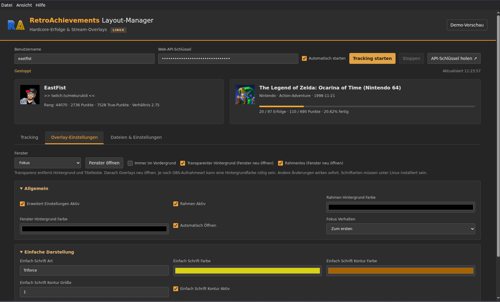

# RA Layout Manager DE

**Inoffizielle deutsche Linux-AppImage des RetroAchievements Layout Managers.**

Diese Variante richtet sich an deutschsprachige RetroAchievements-Nutzer unter Linux und bietet eine weitgehend deutsch übersetzte Benutzeroberfläche sowie eine automatische deutsche Übersetzung von Achievement-Titeln und -Beschreibungen.

> **Hinweis:** Dieses Projekt ist eine inoffizielle Community-Anpassung. Es ist weder ein offizielles Projekt von RetroAchievements noch von Colossus-Gaming und wird von diesen nicht unterstützt oder bestätigt.

## Funktionen

- Deutsche Benutzeroberfläche
- Deutsche Bezeichnungen in den Overlay-Fenstern
- Automatische Übersetzung von Achievement-Titeln ins Deutsche
- Automatische Übersetzung von Achievement-Beschreibungen ins Deutsche
- Lokaler Übersetzungs-Cache, damit bereits übersetzte Achievements nicht ständig neu übersetzt werden müssen
- Englischer Originaltext als Fallback, wenn der Übersetzungsdienst nicht erreichbar ist
- Focus-/Fokus-Overlay
- Achievement-Alerts
- Letzte Erfolge
- Erfolgsliste
- Benutzerinformationen
- Spielinformationen
- Fortschrittsanzeige
- Stream-Labels für OBS und andere Streaming-Software
- Linux-AppImage für x86_64

## Download

Die fertige AppImage wird über **GitHub Releases** bereitgestellt.

Empfohlener Dateiname:

```text
RA-Layout-Manager-DE-v1.0.1-de.1-x86_64.AppImage
```

> Die AppImage sollte nicht direkt in das Git-Repository eingecheckt werden. Sie ist größer als das normale GitHub-Dateilimit und gehört als Release-Asset in einen GitHub Release.

## Installation unter Linux / Nobara

1. Lade die aktuelle `.AppImage` aus dem Bereich **Releases** herunter.
2. Öffne ein Terminal im Download-Ordner.
3. Mache die Datei ausführbar:

```bash
chmod +x RA-Layout-Manager-DE-v1.0.1-de.1-x86_64.AppImage
```

4. Starte die Anwendung:

```bash
./RA-Layout-Manager-DE-v1.0.1-de.1-x86_64.AppImage
```

Alternativ kannst du die AppImage nach dem Setzen der Ausführungsrechte normalerweise auch per Doppelklick starten.

## Einrichtung

Für Live-Daten werden ein RetroAchievements-Benutzername und ein RetroAchievements Web API Key benötigt.

Den API-Key erhältst du in deinen RetroAchievements-Kontoeinstellungen.

**Wichtig:** Behandle deinen API-Key wie ein Passwort. Poste weder den API-Key noch deine komplette `settings.json` in Issues, Screenshots oder öffentlichen Logs.

## Automatische deutsche Achievement-Übersetzung

Achievement-Titel und -Beschreibungen werden bei Bedarf automatisch von Englisch nach Deutsch übersetzt. Bereits übersetzte Inhalte werden lokal zwischengespeichert.

Dabei gilt:

- Für die erste Übersetzung ist eine Internetverbindung erforderlich.
- Die Übersetzung erfolgt maschinell und kann gelegentlich ungenau sein.
- Wenn der Übersetzungsdienst nicht erreichbar ist, wird der englische Originaltext weiterverwendet.
- Für die Übersetzung werden die jeweiligen Achievement-Texte an einen Google-Translate-Endpunkt (`translate.googleapis.com`) übertragen.
- Der lokale Übersetzungs-Cache wird in den App-Daten gespeichert.

## OBS / Streaming

Die Anwendung erzeugt Stream-Labels und Daten für verschiedene Anzeigen. Dazu gehören unter anderem Fokus-Achievement, Alerts, Benutzerinformationen, Spielinformationen und letzte Erfolge.

Der Ordner mit den Stream-Labels kann direkt über die Anwendung geöffnet und anschließend in OBS beispielsweise als Textquelle oder Teil eines Browser-/Overlay-Setups verwendet werden.

## Screenshots

Lege deine Screenshots im Ordner `screenshots/` ab und ersetze später diesen Abschnitt beispielsweise durch:

```markdown

```

## Bekannte Einschränkungen

- Nur Linux x86_64 wird mit dieser AppImage bereitgestellt.
- Maschinelle Übersetzungen sind nicht immer perfekt.
- Die automatische Übersetzung ist von der Erreichbarkeit des externen Übersetzungsdienstes abhängig.
- Änderungen an der RetroAchievements API oder an externen Diensten können einzelne Funktionen beeinflussen.

## Upstream und Credits

Diese Version basiert auf dem Projekt **RetroAchievements Layout Manager** von **Colossus-Gaming**:

https://github.com/Colossus-Gaming/retroachievements-layout-manager

RetroAchievements:

https://retroachievements.org/

Vielen Dank an die ursprünglichen Entwickler und die RetroAchievements-Community.

## Disclaimer / Haftungsausschluss

Dies ist eine **inoffizielle Community-Version**.

- Keine Verbindung, Partnerschaft oder offizielle Unterstützung durch RetroAchievements oder Colossus-Gaming wird behauptet.
- Namen, Marken, Logos und sonstige Rechte Dritter verbleiben bei den jeweiligen Rechteinhabern.
- Die Software wird ohne Gewährleistung bereitgestellt. Die Nutzung erfolgt auf eigenes Risiko.
- Der Autor dieser Anpassung übernimmt keine Haftung für Datenverlust, Ausfälle, fehlerhafte Übersetzungen oder Änderungen an externen Diensten/APIs.
- Dieser Disclaimer erteilt **keine** zusätzlichen Rechte zur Nutzung oder Weiterverbreitung von Software oder Assets Dritter.

Weitere Hinweise stehen in [DISCLAIMER.md](DISCLAIMER.md) und [CREDITS.md](CREDITS.md).

## Lizenz- und Rechtehinweis

Für das gefundene Upstream-Repository ist keine eindeutige allgemeine Projektlizenz Bestandteil dieser Veröffentlichungsvorlage. Deshalb enthält dieses Repository bewusst **keine neu erfundene Lizenz**, die Rechte an fremdem Code oder fremden Assets versprechen würde.

Bevor du veränderte Binärdateien öffentlich weiterverbreitest, solltest du sicherstellen, dass du dafür die erforderliche Erlaubnis bzw. Lizenz besitzt. Drittanbieter-Komponenten wie Electron/Chromium können eigene Lizenztexte enthalten, die zusätzlich gelten.

## Fehler melden

Bitte nutze die GitHub-Issue-Vorlage und beschreibe:

- Linux-Distribution und Version
- Desktop-Umgebung (z. B. KDE Plasma oder GNOME)
- App-Version
- Was du erwartet hast
- Was tatsächlich passiert ist
- Schritte zum Reproduzieren

**Niemals RetroAchievements API-Keys oder andere Zugangsdaten posten.**
